# Design Document

## Overview

This design addresses critical security vulnerabilities and code quality issues identified in the EcoCode platform. The implementation focuses on three priority levels: security fixes (Priority 1), error handling improvements (Priority 2), and performance optimizations (Priority 3).

The design follows a systematic approach to fix each vulnerability while maintaining backward compatibility and ensuring minimal disruption to existing functionality. All fixes are implemented with proper validation, error handling, and logging to prevent regression and enable monitoring.

## Architecture

### Security Layer Enhancement

The security fixes are implemented as a new validation layer that intercepts potentially dangerous operations before they reach the underlying system components. This approach ensures comprehensive protection without requiring extensive refactoring of existing code.


### Error Handling Architecture

A centralized error handling system is implemented to provide consistent error management across the desktop client and orchestrator service. This includes retry mechanisms, graceful degradation, and user-friendly error messages.

```mermaid
graph TD
    A[Function Call] --> B[Try Block]
    B --> C{Success?}
    C -->|Yes| D[Return Result]
    C -->|No| E[Error Handler]
    E --> F[Log Error]
    E --> G[Determine Recovery Strategy]
    G --> H{Recoverable?}
    H -->|Yes| I[Retry with Backoff]
    H -->|No| J[Return User-Friendly Error]
    I --> B
```



### Performance Optimization Strategy

Performance improvements focus on algorithmic optimizations and memory usage reduction, particularly for the Levenshtein distance calculation used in spec validation.

## Components and Interfaces

### 1. URL Validation Component (apps/desktop/src/main/main.ts)

**Interface:**
```typescript
interface URLValidator {
  validateURL(url: string): ValidationResult;
  isAllowedProtocol(protocol: string): boolean;
  isSafeHost(hostname: string): boolean;
}
```

**Implementation:**
- Validates URL format and protocol (http, https, file)
- Checks against allowlist of safe domains
- Blocks suspicious patterns (javascript:, data:, etc.)
- Logs blocked attempts for security monitoring

### 2. Path Validation Component (services/orchestrator/eco_api/specs/)

**Interface:**
```python
class PathValidator:
    def validate_path(self, path: str, base_dir: str) -> ValidationResult
    def sanitize_path(self, path: str) -> str
    def is_path_traversal_attempt(self, path: str) -> bool
```

**Implementation:**
- Resolves paths and checks they remain within allowed directories
- Sanitizes path separators and removes dangerous sequences
- Validates against path traversal patterns (../, ..\, etc.)
- Provides secure path joining functionality

### 3. HTML Sanitization Component (services/orchestrator/eco_api/specs/generators.py)

**Interface:**
```python
class HTMLSanitizer:
    def escape_html(self, content: str) -> str
    def sanitize_user_input(self, input_data: Dict[str, Any]) -> Dict[str, Any]
    def is_script_content(self, content: str) -> bool
```

**Implementation:**
- Escapes HTML special characters (<, >, &, ", ')
- Sanitizes user input in template generation
- Detects and neutralizes script content
- Maintains content readability while ensuring security

### 4. Authorization Validation Component (services/orchestrator/eco_api/specs/workflow_orchestrator.py)

**Interface:**
```python
class AuthorizationValidator:
    def validate_server_side_permissions(self, user_context: UserContext, operation: str) -> bool
    def replace_client_side_checks(self, operation_handler: Callable) -> Callable
    def log_authorization_attempt(self, user_context: UserContext, operation: str, success: bool) -> None
```

**Implementation:**
- Server-side role and permission validation
- Decorator pattern for protecting sensitive operations
- Comprehensive audit logging for security events
- Fallback to deny-by-default for unknown operations

### 5. Error Handling Components

**Desktop Client Error Handler:**
```typescript
interface ErrorHandler {
  handleAxiosError(error: AxiosError): Promise<ErrorResponse>;
  handleIPCError(error: Error, operation: string): ErrorResponse;
  handleElectronProcessError(error: Error): void;
}
```

**Orchestrator Error Handler:**
```python
class ErrorHandler:
    def handle_api_error(self, error: Exception, context: str) -> ErrorResponse
    def handle_file_operation_error(self, error: Exception, file_path: str) -> ErrorResponse
    def should_retry(self, error: Exception) -> bool
```

### 6. Performance Optimization Component

**Optimized Levenshtein Calculator:**
```typescript
interface LevenshteinCalculator {
  calculateDistance(str1: string, str2: string): number;
  calculateSimilarity(str1: string, str2: string): number;
}
```

**Implementation:**
- Space-optimized algorithm using O(min(m,n)) space instead of O(m*n)
- Early termination for identical strings
- Configurable maximum distance threshold for performance

## Data Models

### Security Event Model
```python
@dataclass
class SecurityEvent:
    event_type: str  # "url_blocked", "path_traversal", "xss_attempt", "auth_failure"
    timestamp: datetime
    source_ip: Optional[str]
    user_context: Optional[str]
    attempted_action: str
    blocked_content: str
    severity: str  # "low", "medium", "high", "critical"
```

### Error Context Model
```typescript
interface ErrorContext {
  operation: string;
  timestamp: Date;
  errorType: string;
  originalError: Error;
  userMessage: string;
  technicalDetails: string;
  recoveryActions: string[];
}
```

### Validation Result Model
```python
@dataclass
class ValidationResult:
    is_valid: bool
    errors: List[ValidationError]
    warnings: List[ValidationWarning]
    security_events: List[SecurityEvent] = field(default_factory=list)
```

## Error Handling

### Centralized Error Management

All components implement consistent error handling patterns:

1. **Immediate Error Capture**: All operations wrapped in try-catch blocks
2. **Error Classification**: Errors categorized by type and severity
3. **User-Friendly Messages**: Technical errors translated to actionable user messages
4. **Recovery Strategies**: Automatic retry for transient errors, graceful degradation for permanent failures
5. **Comprehensive Logging**: All errors logged with context for debugging

### Security Error Handling

Security violations receive special treatment:

1. **Immediate Blocking**: Dangerous operations stopped immediately
2. **Security Logging**: All security events logged to dedicated security log
3. **Alert Generation**: Critical security events trigger alerts
4. **Forensic Data**: Sufficient context captured for security analysis

### Error Recovery Patterns

```python
class ErrorRecoveryStrategy:
    def __init__(self, max_retries: int = 3, backoff_factor: float = 1.5):
        self.max_retries = max_retries
        self.backoff_factor = backoff_factor
    
    async def execute_with_retry(self, operation: Callable, *args, **kwargs):
        for attempt in range(self.max_retries + 1):
            try:
                return await operation(*args, **kwargs)
            except RetryableError as e:
                if attempt == self.max_retries:
                    raise
                await asyncio.sleep(self.backoff_factor ** attempt)
            except NonRetryableError:
                raise
```

## Testing Strategy

### Security Testing

1. **Penetration Testing**: Automated tests for each security vulnerability
2. **Fuzzing**: Random input testing for validation functions
3. **Regression Testing**: Ensure fixes don't break existing functionality
4. **Integration Testing**: End-to-end security validation

### Error Handling Testing

1. **Fault Injection**: Simulate various error conditions
2. **Network Failure Simulation**: Test API error handling
3. **Resource Exhaustion**: Test behavior under resource constraints
4. **Recovery Testing**: Verify error recovery mechanisms

### Performance Testing

1. **Benchmark Testing**: Measure performance improvements
2. **Memory Usage Testing**: Verify memory optimization
3. **Load Testing**: Ensure performance under load
4. **Regression Testing**: Prevent performance degradation

### Test Implementation Strategy

```typescript
// Security test example
describe('URL Validation', () => {
  test('blocks malicious URLs', () => {
    const maliciousUrls = [
      'javascript:alert("xss")',
      'data:text/html,<script>alert("xss")</script>',
      'file:///etc/passwd'
    ];
    
    maliciousUrls.forEach(url => {
      expect(() => validateAndOpenURL(url)).toThrow('Security violation');
    });
  });
});

// Error handling test example
describe('API Error Handling', () => {
  test('retries on network errors', async () => {
    const mockApi = jest.fn()
      .mockRejectedValueOnce(new NetworkError())
      .mockResolvedValueOnce({ data: 'success' });
    
    const result = await executeWithRetry(mockApi);
    expect(result.data).toBe('success');
    expect(mockApi).toHaveBeenCalledTimes(2);
  });
});
```

### Automated Security Scanning

Integration with security scanning tools to prevent regression:

1. **Static Analysis**: ESLint security rules, Bandit for Python
2. **Dependency Scanning**: Regular updates and vulnerability checks
3. **Code Review**: Security-focused code review checklist
4. **Continuous Monitoring**: Runtime security monitoring and alerting