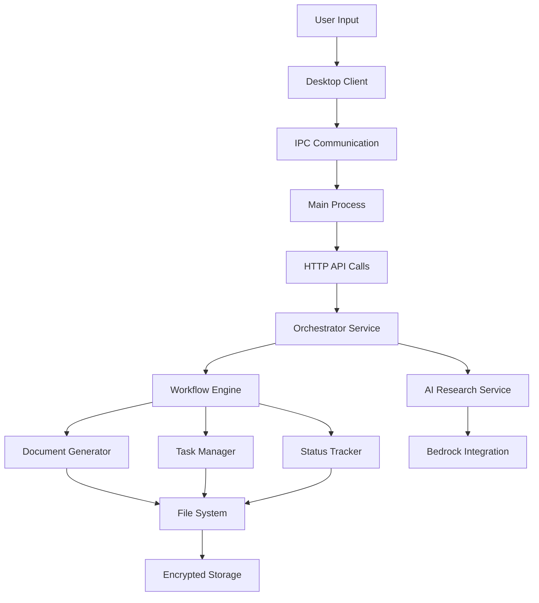
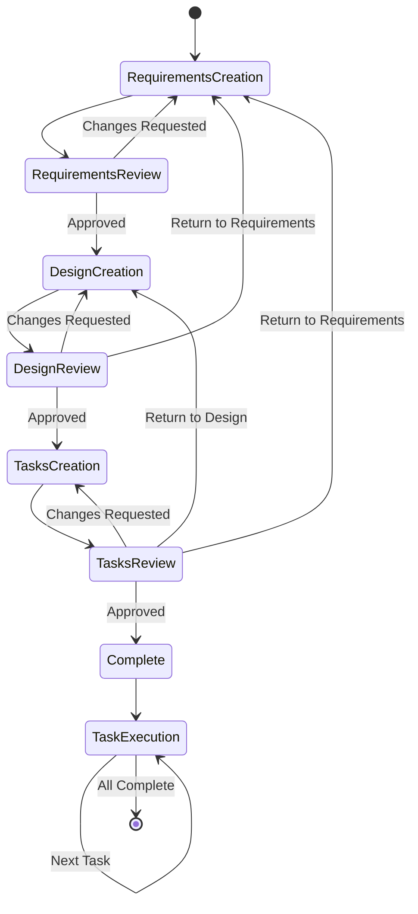

# Design Document

## Overview

The Spec-Driven Design feature implements a comprehensive workflow orchestration system that transforms rough feature ideas into production-ready implementation plans through a structured three-phase methodology. The system integrates seamlessly with the existing EcoCode architecture, leveraging the Electron desktop client for user interaction and the FastAPI orchestrator service for workflow management and persistence.

The feature operates as a state machine with explicit approval gates, ensuring user control at each phase while providing intelligent automation for document generation, research integration, and task execution. The design emphasizes local-first operation with encrypted storage, maintaining consistency with EcoCode's security model.

## Architecture

### System Boundaries

The Spec-Driven Design feature operates within the existing EcoCode architecture boundaries:

- **Desktop Client (Electron)**: Provides the user interface for spec creation, review, and task execution
- **Orchestrator Service (FastAPI)**: Handles workflow state management, document persistence, and AI integration
- **Local File System**: Stores spec documents in `.kiro/specs/` directory structure with optional encryption
- **AI Integration**: Leverages existing Bedrock integration for research and content generation

### Data Flow Architecture



### Workflow State Machine

The system implements a finite state machine with the following states and transitions:



## Components and Interfaces

### 1. Workflow Orchestrator

**Purpose**: Central coordinator for the spec-driven workflow process

**Interface**:
```typescript
interface WorkflowOrchestrator {
  createSpec(featureIdea: string): Promise<SpecWorkflow>;
  updateSpec(specId: string, phase: WorkflowPhase): Promise<SpecWorkflow>;
  executeTask(specId: string, taskId: string): Promise<TaskResult>;
  getSpecStatus(specId: string): Promise<SpecStatus>;
}

interface SpecWorkflow {
  id: string;
  featureName: string;
  currentPhase: WorkflowPhase;
  documents: SpecDocuments;
  status: WorkflowStatus;
  createdAt: Date;
  updatedAt: Date;
}

enum WorkflowPhase {
  REQUIREMENTS = 'requirements',
  DESIGN = 'design',
  TASKS = 'tasks',
  EXECUTION = 'execution'
}
```

**Responsibilities**:
- Manage workflow state transitions
- Coordinate document generation and updates
- Handle approval workflows with user input
- Maintain workflow persistence and recovery

### 2. Document Generator Service

**Purpose**: Generate and update spec documents with AI assistance

**Interface**:
```typescript
interface DocumentGenerator {
  generateRequirements(featureIdea: string): Promise<RequirementsDocument>;
  generateDesign(requirements: RequirementsDocument, research: ResearchContext): Promise<DesignDocument>;
  generateTasks(design: DesignDocument, requirements: RequirementsDocument): Promise<TasksDocument>;
  updateDocument<T>(document: T, changes: DocumentChanges): Promise<T>;
}

interface RequirementsDocument {
  introduction: string;
  requirements: Requirement[];
  metadata: DocumentMetadata;
}

interface Requirement {
  id: string;
  userStory: UserStory;
  acceptanceCriteria: AcceptanceCriterion[];
}

interface AcceptanceCriterion {
  id: string;
  condition: string;
  action: string;
  result: string;
  format: 'WHEN_THEN' | 'IF_THEN' | 'GIVEN_WHEN_THEN';
}
```

**Responsibilities**:
- Generate structured documents using AI assistance
- Maintain document format consistency and validation
- Handle document updates and change tracking
- Ensure requirement traceability across documents

### 3. Research Integration Service

**Purpose**: Conduct contextual research to inform design decisions

**Interface**:
```typescript
interface ResearchService {
  conductResearch(requirements: RequirementsDocument): Promise<ResearchContext>;
  identifyResearchAreas(requirements: RequirementsDocument): ResearchArea[];
  gatherTechnicalContext(areas: ResearchArea[]): Promise<TechnicalContext>;
}

interface ResearchContext {
  technicalFindings: TechnicalFinding[];
  architecturalPatterns: ArchitecturalPattern[];
  implementationApproaches: ImplementationApproach[];
  constraints: TechnicalConstraint[];
}

interface TechnicalFinding {
  area: string;
  findings: string[];
  sources: string[];
  relevance: number;
}
```

**Responsibilities**:
- Identify research needs from requirements
- Gather relevant technical information
- Provide context for design decisions
- Maintain research traceability

### 4. Task Execution Engine

**Purpose**: Execute individual implementation tasks with context awareness

**Interface**:
```typescript
interface TaskExecutionEngine {
  executeTask(task: Task, context: ExecutionContext): Promise<TaskResult>;
  updateTaskStatus(taskId: string, status: TaskStatus): Promise<void>;
  getNextTask(specId: string): Promise<Task | null>;
  validateTaskCompletion(task: Task, result: TaskResult): Promise<ValidationResult>;
}

interface Task {
  id: string;
  description: string;
  requirements: string[];
  dependencies: string[];
  estimatedEffort: number;
  status: TaskStatus;
  subtasks: Task[];
}

interface ExecutionContext {
  requirements: RequirementsDocument;
  design: DesignDocument;
  projectStructure: ProjectStructure;
  existingCode: CodeContext;
}

enum TaskStatus {
  NOT_STARTED = 'not_started',
  IN_PROGRESS = 'in_progress',
  COMPLETED = 'completed',
  BLOCKED = 'blocked'
}
```

**Responsibilities**:
- Execute tasks with full context awareness
- Manage task dependencies and sequencing
- Track progress and update status
- Validate task completion against requirements

### 5. File System Manager

**Purpose**: Handle spec document persistence and organization

**Interface**:
```typescript
interface FileSystemManager {
  createSpecDirectory(featureName: string): Promise<string>;
  saveDocument(specId: string, document: SpecDocument): Promise<void>;
  loadDocument<T>(specId: string, documentType: DocumentType): Promise<T>;
  validateSpecStructure(specId: string): Promise<ValidationResult>;
  listSpecs(): Promise<SpecSummary[]>;
}

interface SpecDocument {
  type: DocumentType;
  content: string;
  metadata: DocumentMetadata;
  checksum: string;
}

enum DocumentType {
  REQUIREMENTS = 'requirements',
  DESIGN = 'design',
  TASKS = 'tasks'
}
```

**Responsibilities**:
- Manage spec directory structure
- Handle document serialization and persistence
- Validate file integrity and structure
- Provide spec discovery and listing

## Data Models

### Core Workflow Models

```typescript
interface SpecificationWorkflow {
  id: string;
  featureName: string;
  description: string;
  currentPhase: WorkflowPhase;
  status: WorkflowStatus;
  documents: {
    requirements?: RequirementsDocument;
    design?: DesignDocument;
    tasks?: TasksDocument;
  };
  metadata: {
    createdAt: Date;
    updatedAt: Date;
    createdBy: string;
    version: string;
  };
  approvals: {
    requirements?: ApprovalRecord;
    design?: ApprovalRecord;
    tasks?: ApprovalRecord;
  };
}

interface ApprovalRecord {
  approved: boolean;
  approvedAt: Date;
  feedback?: string;
  iteration: number;
}
```

### Document Structure Models

```typescript
interface RequirementsDocument {
  introduction: string;
  requirements: Requirement[];
  metadata: DocumentMetadata;
}

interface DesignDocument {
  overview: string;
  architecture: ArchitectureSection;
  components: ComponentSection;
  dataModels: DataModelSection;
  errorHandling: ErrorHandlingSection;
  testingStrategy: TestingStrategySection;
  metadata: DocumentMetadata;
}

interface TasksDocument {
  tasks: Task[];
  metadata: DocumentMetadata;
  progress: {
    total: number;
    completed: number;
    inProgress: number;
    notStarted: number;
  };
}
```

### Persistence Models

```typescript
interface SpecFileStructure {
  specId: string;
  basePath: string;
  files: {
    requirements: string; // requirements.md
    design: string;       // design.md
    tasks: string;        // tasks.md
    metadata: string;     // .spec-metadata.json
  };
}

interface SpecMetadata {
  id: string;
  featureName: string;
  version: string;
  createdAt: string;
  updatedAt: string;
  currentPhase: WorkflowPhase;
  status: WorkflowStatus;
  checksum: {
    requirements?: string;
    design?: string;
    tasks?: string;
  };
}
```

## Error Handling

### Error Categories and Strategies

1. **Workflow State Errors**
   - Invalid state transitions
   - Missing prerequisite documents
   - Corrupted workflow state
   - **Strategy**: State validation with automatic recovery and user guidance

2. **Document Generation Errors**
   - AI service failures
   - Content validation failures
   - Format inconsistencies
   - **Strategy**: Retry mechanisms with fallback templates and user intervention options

3. **File System Errors**
   - Permission issues
   - Disk space constraints
   - File corruption
   - **Strategy**: Graceful degradation with temporary storage and recovery procedures

4. **Task Execution Errors**
   - Code generation failures
   - Dependency conflicts
   - Test failures
   - **Strategy**: Rollback capabilities with detailed error reporting and suggested fixes

### Error Recovery Mechanisms

```typescript
interface ErrorRecoveryService {
  handleWorkflowError(error: WorkflowError): Promise<RecoveryAction>;
  recoverFromCorruption(specId: string): Promise<RecoveryResult>;
  validateAndRepair(specId: string): Promise<ValidationResult>;
}

interface RecoveryAction {
  type: 'retry' | 'rollback' | 'manual_intervention' | 'skip';
  message: string;
  suggestedActions: string[];
  automaticRecovery: boolean;
}
```

### Validation Framework

- **Document Structure Validation**: Ensure proper markdown format and required sections
- **Content Validation**: Verify requirement traceability and consistency
- **State Validation**: Confirm workflow state integrity and valid transitions
- **File System Validation**: Check directory structure and file permissions

## Testing Strategy

### Unit Testing Approach

1. **Component Isolation Testing**
   - Mock external dependencies (AI services, file system)
   - Test individual workflow components in isolation
   - Validate state transitions and error handling
   - **Coverage Target**: 90% for core workflow logic

2. **Document Generation Testing**
   - Test template generation with various inputs
   - Validate document structure and format
   - Test requirement traceability maintenance
   - **Coverage Target**: 85% for document generators

### Integration Testing Strategy

1. **Workflow Integration Tests**
   - End-to-end workflow execution
   - Cross-component communication validation
   - State persistence and recovery testing
   - **Test Scenarios**: Complete spec creation, partial workflows, error recovery

2. **API Integration Tests**
   - Desktop client to orchestrator communication
   - File system operations and persistence
   - AI service integration and fallbacks
   - **Test Coverage**: All API endpoints and IPC channels

### End-to-End Testing Framework

1. **User Journey Testing**
   - Complete spec creation workflows
   - Task execution and progress tracking
   - Error scenarios and recovery paths
   - **Automation Level**: 70% automated, 30% manual validation

2. **Performance Testing**
   - Large spec handling and memory usage
   - Concurrent workflow execution
   - File system performance under load
   - **Benchmarks**: Sub-second response times, <100MB memory usage

### Test Data Management

- **Synthetic Test Specs**: Generated test specifications for various complexity levels
- **Mock AI Responses**: Predefined responses for consistent testing
- **File System Mocking**: Isolated test environments with controlled file operations
- **State Fixtures**: Predefined workflow states for testing transitions and recovery